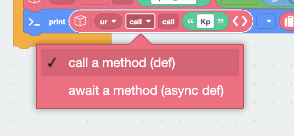

# uRemote async example

Use ``call_async()`` when multiple Pybricks tasks share
one UART connection under ``multitask()`` / ``run_task()``. The wire protocol
and ESP32 ``process()`` server are unchanged.

Copy ``library/uremote.py`` to the hub as ``uremote.py``.

## Why async

A sync ``call()`` blocks other tasks while waiting for the UART reply.
``call_async()`` yields (``await uart.read/write`` on Pybricks) so other
coroutines can run. A cooperative lock serializes each full request/reply so
tasks do not steal each other's answers.

Do not mix ``call()`` and ``call_async()`` on the same instance while multitasking —
the lock only covers the async path. Prefer ``call_async()`` consistently, and
``await wait(0)`` between calls so sibling tasks get a turn.

Under ``run_task()``, change the method dropdown from sync ``call`` to ``await``:

<p align="center">
  
</p>

## Pybricks

See ``pybricks/ur_async_test.py``. Sketch:

```python
from pybricks.hubs import PrimeHub
from pybricks.parameters import Axis, Port
from pybricks.tools import multitask, run_task, wait
from uremote import uRemote

prime_hub = PrimeHub()
ur = uRemote(Port.C)

async def telemetry():
    while True:
        await ur.call_async(
            "spike_data",
            round(prime_hub.imu.rotation(Axis.X)),
            round(prime_hub.imu.rotation(Axis.Y)),
            round(prime_hub.imu.rotation(Axis.Z)),
        )
        print("kp", await ur.call_async("Kp"))
        await wait(0)

async def motor_task():
    while True:
        print("motor", await ur.call_async("motor"))
        await wait(0)

async def main():
    await multitask(telemetry(), motor_task())

run_task(main())
```

<p align="center">
  
</p>

## ESP32 server

Stay synchronous — see ``esp32/esp32_ur_test.py``:

```python
from uremote import uRemote

ur = uRemote()
i = 0

def motor():
    return i * 2

def Kp():
    return i * 3

def spike_data(x, y, z):
    print(x, y, z)

while True:
    ur.process()
    i = (i + 1) % 1001
```

``call_async()`` is Pybricks-only. ESP32 remotes stay on sync ``process()``.
